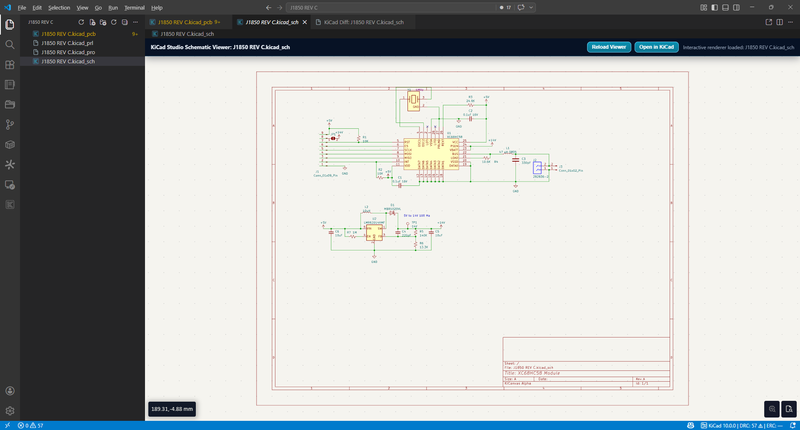
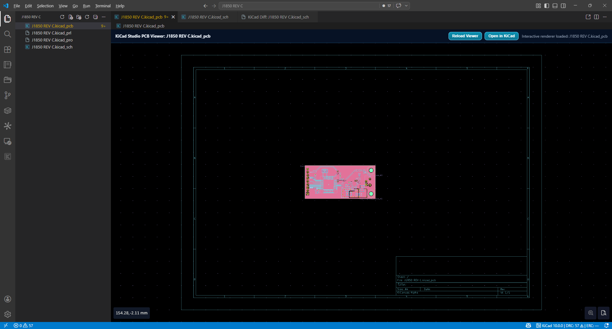
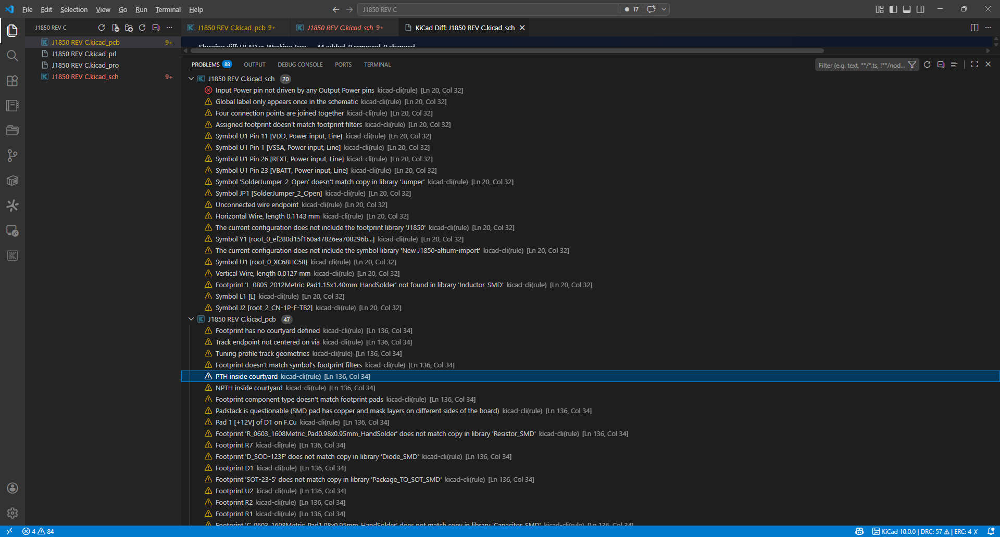
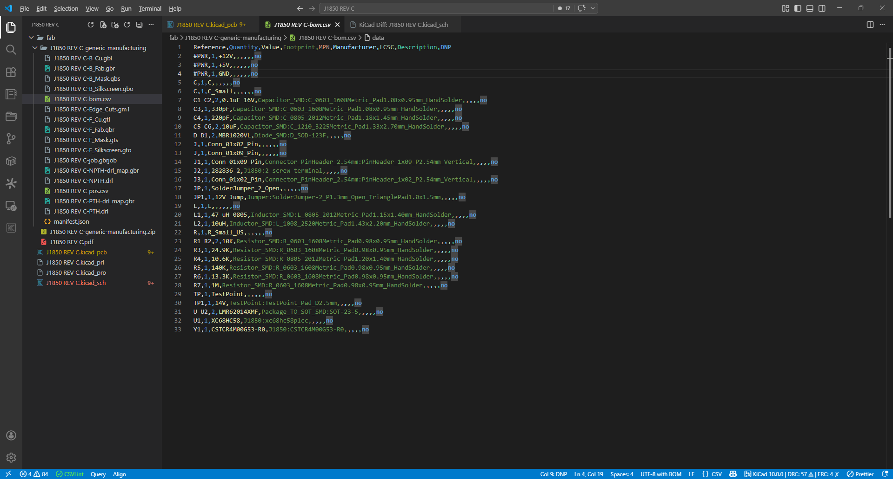
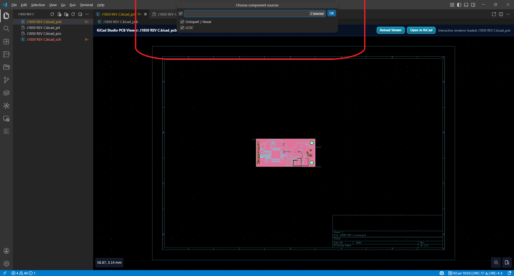
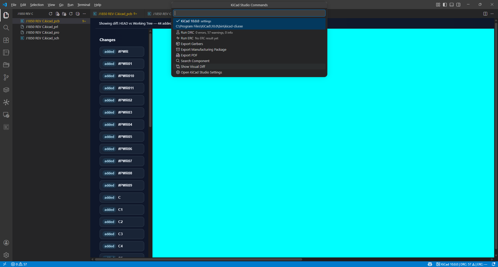
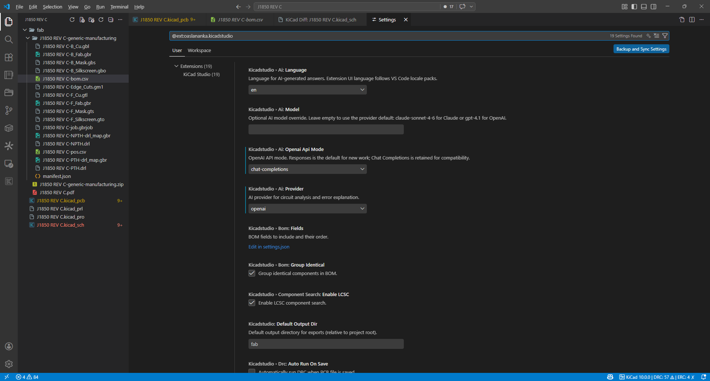

# KiCad Studio

The complete KiCad development environment for VS Code: open schematics and PCBs, run DRC/ERC, export production files, inspect BOMs, search components, compare design revisions, and optionally get AI-powered design guidance.

Public GitHub repository:
`https://github.com/oaslananka/kicad-studio`

Primary repository and CI/CD live in Azure DevOps:
`https://dev.azure.com/oaslananka/open-source/_git/kicad-studio`

## Feature List

- `🧭` Interactive schematic viewer powered by a bundled KiCanvas build.
- `🧱` PCB viewer with layer summaries, quick presets, and save-to-refresh workflow.
- `⚡` One-command exports for fab and documentation outputs.
- `🩺` DRC/ERC diagnostics mapped into the VS Code Problems panel.
- `📦` Bill of Materials side view with filtering, sorting, and export.
- `🔎` Component lookup through Octopart/Nexar and LCSC.
- `🔀` Visual Git diff for KiCad schematics.
- `🤖` Optional AI analysis for errors and selected circuit blocks.
- `🌲` KiCad-aware project explorer, jobset awareness, and reusable VS Code tasks.

## Feature Matrix

| Area                          | Status                                                                           |
| ----------------------------- | -------------------------------------------------------------------------------- |
| KiCanvas schematic/PCB viewer | Bundled, CSP-restricted, save-refresh aware                                      |
| DRC/ERC                       | `kicad-cli` backed, Problems panel integration, optional auto-run on save        |
| Fabrication exports           | Gerber, drill, IPC-2581, ODB++, DXF, GenCAD, IPC-D-356, pick-and-place           |
| 3D exports                    | GLB, BREP, PLY                                                                   |
| Manufacturing package         | Generic, JLCPCB, and PCBWay ZIP profiles                                         |
| BOM/netlist                   | BOM CSV/XLSX/HTML plus CLI-backed net/node extraction                            |
| AI                            | Claude and OpenAI with secure SecretStorage keys and language-selectable prompts |
| Jobsets                       | `.kicad_jobset` discovery and `kicad-cli jobset run` command                     |

## Requirements

- KiCad 6 or newer installed locally. `kicad-cli` is required for checks and most exports.
- VS Code 1.95.0 or newer.
- Optional API keys:
  - Octopart/Nexar API key for richer component search.
  - Anthropic or OpenAI API key for AI-assisted analysis.

## Installation

- Marketplace: search for `KiCad Studio` by `oaslananka`.
- Command line:

```bash
code --install-extension oaslananka.kicadstudio
```

## Quick Start

1. Open a folder that contains a `.kicad_pro`, `.kicad_sch`, or `.kicad_pcb` file.
2. Run `KiCad: Detect kicad-cli` once so the extension can validate your KiCad installation.
3. Open a schematic or PCB file to start using the custom viewer, BOM panel, project tree, exports, and checks.

## Features — Detailed

### Schematic Viewer



- Opens `.kicad_sch` files in a readonly custom editor.
- Uses a strict webview CSP and local-only rendering.
- Supports fit, zoom, grid toggle, theme toggle, and open-in-KiCad actions.
- Refreshes automatically on save when `kicadstudio.viewer.autoRefresh` is enabled.

### PCB Viewer



- Opens `.kicad_pcb` files in a readonly custom editor.
- Shows detected board layers with accessibility-friendly labels and colors.
- Includes quick layer preset buttons for copper, fab, assembly, and user layers.
- Gracefully degrades when the bundled KiCanvas build does not expose programmable layer toggles.

### Export Commands

| Command                                  | Shortcut           | Output                                           |
| ---------------------------------------- | ------------------ | ------------------------------------------------ |
| `KiCad: Export Gerber Files`             | `Ctrl/Cmd+Shift+G` | Gerbers                                          |
| `KiCad: Export Gerbers + Drill Files`    | —                  | Gerbers + drill maps                             |
| `KiCad: Export PDF (Schematic)`          | —                  | Schematic PDF                                    |
| `KiCad: Export PDF (PCB)`                | —                  | PCB PDF                                          |
| `KiCad: Export SVG`                      | —                  | SVG artwork                                      |
| `KiCad: Export IPC-2581`                 | —                  | IPC-2581 package                                 |
| `KiCad: Export ODB++`                    | —                  | ODB++ archive                                    |
| `KiCad: Export 3D Model (GLB)`           | —                  | GLB board model                                  |
| `KiCad: Export 3D Model (BREP)`          | —                  | BREP board model                                 |
| `KiCad: Export 3D Model (PLY)`           | —                  | PLY board model                                  |
| `KiCad: Export GenCAD`                   | —                  | GenCAD manufacturing data                        |
| `KiCad: Export IPC-D-356 Netlist`        | —                  | IPC-D-356 netlist                                |
| `KiCad: Export DXF`                      | —                  | DXF drawings                                     |
| `KiCad: Export Pick and Place`           | —                  | CSV centroid file                                |
| `KiCad: Export Manufacturing Package`    | —                  | Gerber, drill, BOM, pick-and-place, manifest ZIP |
| `KiCad: Export Bill of Materials (CSV)`  | —                  | BOM CSV                                          |
| `KiCad: Export Bill of Materials (XLSX)` | —                  | BOM XLSX                                         |
| `KiCad: Export Netlist`                  | —                  | KiCad S-expression netlist                       |
| `KiCad: Export Interactive HTML BOM`     | —                  | Interactive HTML BOM                             |

### DRC / ERC



- Runs `kicad-cli` DRC and ERC in-progress notifications.
- Converts JSON results into VS Code diagnostics.
- Updates the KiCad status bar summary with error and warning counts.
- Opens the Problems panel automatically when issues are found.

### BOM Table



- Parses schematic symbols directly from the KiCad S-expression AST.
- Groups identical components, preserves DNP flags, and keeps common manufacturing fields.
- Supports text filtering, column sorting, CSV export, and XLSX export.
- Jump-to-reference flow opens the matching schematic entry in the text editor.

### Component Search



- Supports Octopart/Nexar and LCSC search sources.
- Opens a detail panel for offers, datasheet access, and copy-to-clipboard actions.
- Uses secure secret storage commands for API keys instead of relying on plaintext settings.

### Git Diff



- Compares `HEAD` against the working tree for schematic files.
- Matches symbols by UUID or reference fallback and classifies added, removed, and changed parts.
- Renders a two-pane visual diff webview with a quick navigation list.

### AI Assistant



- `KiCad: AI Analyze Selected Error` asks the configured provider to explain a DRC/ERC issue.
- `KiCad: AI Explain Selected Block` analyzes selected text from the active editor.
- AI features are fully opt-in and remain disabled when no provider or secret key is configured.

## Configuration

| Setting                                  | Default                                                                           | Description                                                                                         |
| ---------------------------------------- | --------------------------------------------------------------------------------- | --------------------------------------------------------------------------------------------------- |
| `kicadstudio.kicadCliPath`               | `""`                                                                              | Explicit path to `kicad-cli`. Leave empty for auto-detection.                                       |
| `kicadstudio.kicadPath`                  | `""`                                                                              | Path to the KiCad installation directory or executable used by `Open in KiCad`.                     |
| `kicadstudio.defaultOutputDir`           | `fab`                                                                             | Default export output directory relative to the workspace root.                                     |
| `kicadstudio.gerber.precision`           | `6`                                                                               | Gerber precision.                                                                                   |
| `kicadstudio.gerber.useProtelExtension`  | `false`                                                                           | Reserved compatibility flag for Gerber file naming.                                                 |
| `kicadstudio.ipc2581.version`            | `C`                                                                               | IPC-2581 version.                                                                                   |
| `kicadstudio.ipc2581.units`              | `mm`                                                                              | IPC-2581 export units.                                                                              |
| `kicadstudio.bom.groupIdentical`         | `true`                                                                            | Group identical BOM entries.                                                                        |
| `kicadstudio.bom.fields`                 | `["Reference","Value","Footprint","Quantity","MPN","Manufacturer","Description"]` | Ordered BOM fields.                                                                                 |
| `kicadstudio.viewer.theme`               | `dark`                                                                            | Viewer theme hint for CLI-backed exports and webviews.                                              |
| `kicadstudio.viewer.autoRefresh`         | `true`                                                                            | Refresh viewers when the source file is saved.                                                      |
| `kicadstudio.componentSearch.enableLCSC` | `true`                                                                            | Enable LCSC search results.                                                                         |
| `kicadstudio.ai.provider`                | `none`                                                                            | AI provider: `none`, `claude`, or `openai`.                                                         |
| `kicadstudio.ai.model`                   | `""`                                                                              | Optional model override. Leave empty to use `claude-sonnet-4-6` for Claude or `gpt-4.1` for OpenAI. |
| `kicadstudio.ai.openaiApiMode`           | `responses`                                                                       | OpenAI API mode: `responses` or `chat-completions`.                                                 |
| `kicadstudio.ai.language`                | `en`                                                                              | Language for AI-generated answers: `en`, `tr`, `de`, `zh-CN`, or `ja`.                              |
| `kicadstudio.drc.autoRunOnSave`          | `false`                                                                           | Automatically run DRC when a PCB file is saved.                                                     |
| `kicadstudio.erc.autoRunOnSave`          | `false`                                                                           | Automatically run ERC when a schematic file is saved.                                               |
| `kicadstudio.exportPresets`              | `[]`                                                                              | Stored export presets managed by the extension.                                                     |

Plaintext API key settings have been removed from runtime use. Use `KiCad: Set AI API Key` and `KiCad: Set Octopart/Nexar API Key`; old plaintext values are migrated to VS Code SecretStorage on activation when found.

## Viewer Limitations

- KiCanvas does not support KiCad 5 files. Use KiCad 6 or newer project files for interactive viewing.
- KiCad 10 support is improving, but some newer entities may still render incompletely until upstream KiCanvas catches up.
- In some remote, WSL, or restricted WebGL environments, the interactive viewer may fail and the extension may need to fall back to safe preview behavior.

## Keyboard Shortcuts

| Command        | Windows / Linux | macOS         |
| -------------- | --------------- | ------------- |
| Run DRC        | `Ctrl+Shift+D`  | `Cmd+Shift+D` |
| Run ERC        | `Ctrl+Shift+E`  | `Cmd+Shift+E` |
| Export Gerbers | `Ctrl+Shift+G`  | `Cmd+Shift+G` |

## KiCad CLI Setup

### Windows

1. Install KiCad 6, 7, 8, 9, or 10.
2. KiCad Studio checks these common locations automatically:
   - `%PROGRAMFILES%\KiCad\{9,8,7,6}\bin\kicad-cli.exe`
   - `%PROGRAMFILES(X86)%\KiCad\{9,8,7,6}\bin\kicad-cli.exe`
3. If your installation is custom, set `kicadstudio.kicadCliPath`.

### macOS

1. Install KiCad into `/Applications`.
2. KiCad Studio checks:
   - `/Applications/KiCad/KiCad.app/Contents/MacOS/kicad-cli`
   - `/usr/local/bin/kicad-cli`
   - `/opt/homebrew/bin/kicad-cli`
3. If needed, point `kicadstudio.kicadCliPath` to the bundled executable.

### Linux

1. Install KiCad from your distribution, AppImage, or package manager.
2. KiCad Studio checks:
   - `/usr/bin/kicad-cli`
   - `/usr/local/bin/kicad-cli`
   - `/snap/bin/kicad-cli`
   - `~/.local/bin/kicad-cli`
3. If `kicad-cli` lives elsewhere, configure `kicadstudio.kicadCliPath`.

## Contributing

1. Clone the repository and install dependencies with `npm install`.
2. Run `npm run build` for a development bundle.
3. Run `npm run lint`, `npm run test:unit`, and `npm test` before opening a pull request.
4. Use the Extension Development Host launch profile in `.vscode/launch.json` for manual testing.
5. Keep commits focused and include screenshots or reproduction steps for UI-facing changes.
6. Azure DevOps is the source of truth for CI/CD and release approval for this project.

## Development Notes

- `npm run build:prod` creates the production bundle in `dist/`.
- `npm run package` creates a `.vsix` package ready for Marketplace upload.
- `scripts/bundle-kicanvas.js` vendors a KiCanvas build into `media/kicanvas/`.
- `scripts/generate-icon.js` regenerates icons and screenshot placeholders.
- `azure-pipelines-ci.yml` is the primary CI pipeline definition in Azure DevOps.
- `azure-pipelines-publish.yml` is the manual, approval-gated Marketplace publish pipeline in Azure DevOps.
- GitHub Actions are kept as manual fallback workflows only.

## License

MIT
